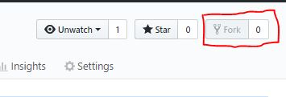
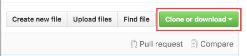
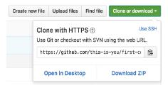
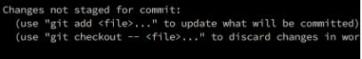
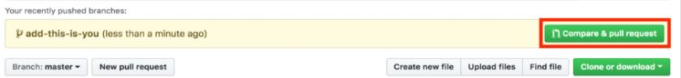
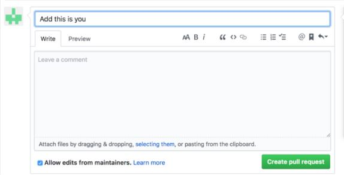

# First Timers Contributions


Make sure you have Git installed, If you don't have git on your machine, [install it]( https://help.github.com/articles/set-up-git/).

## Fork this repository


Fork this repo by clicking on the fork button on the top of this page.
This will create a copy of this repository in your account.

## Clone the repository



Now clone the forked repo to your machine. Go to your GitHub account, open the forked repo, click on the clone button and then click the *copy to clipboard* icon.

Open a terminal and run the following git command:

```
git clone "url you just copied"
```
where "url you just copied" (without the quote marks) is the url to this repository (your fork of this project). See the previous steps to obtain the url.



For example:
```
git clone https://github.com/this-is-you/starter-project.git
```
where `this-is-you` is your GitHub username. Here you're copying the contents of the starter-project repository in GitHub to your computer.

## Create a branch

Change to the repository directory on your computer (if you are not already there):

```
cd starter-project
```
Now create a branch using the `git checkout` command:
```
git checkout -b <add-your-new-branch-name>
```

For example:
```
git checkout -b add-my-profile
```
(The name of the branch does not need to have the word *add* in it, but it's a reasonable thing to include because the purpose of this branch is to add your profile to a list.)

## Make necessary changes and commit those changes

Now open `person.json` file in a text editor, add your name, image, and reason why you code to it. in the below format inside the square 
brackets [] and save your changes.
```
  {
    "firstname": "Your firstname here",
    "lastname": "Your lastname here",
    "image": "/starter_project/assets/image/<your_image_name.ext>",
    "word": "Reason why you learn to code"
  },  
```
Now, save the file. 




If you go to the project directory and execute the command `git status`, you'll see there are changes. 


Add those changes to the branch you just created using the `git add` command:

```
git add person.json
```

Now commit those changes using the `git commit` command:
```
git commit -m "Add my profile to the list"
```

## Push changes to GitHub

Push your changes using the command `git push`:
```
git push origin <add-your-branch-name>
```
replacing `<add-your-branch-name>` with the name of the branch you created earlier.

## Submit your changes for review

If you go to your repository on GitHub, you'll see a  `Compare & pull request` button.  Click on that button.



Now submit the pull request.



Soon I'll be merging all your changes into the master branch of this project. You will get a notification email once the changes have been merged.

## Where to go from here?

Congrats!  You just completed the standard _fork -> clone -> edit -> PR_ workflow that you'll encounter often as a contributor!

